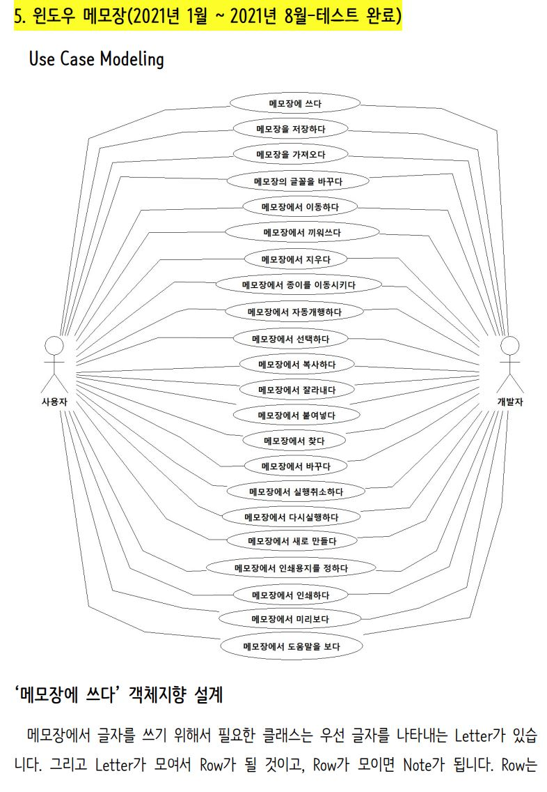
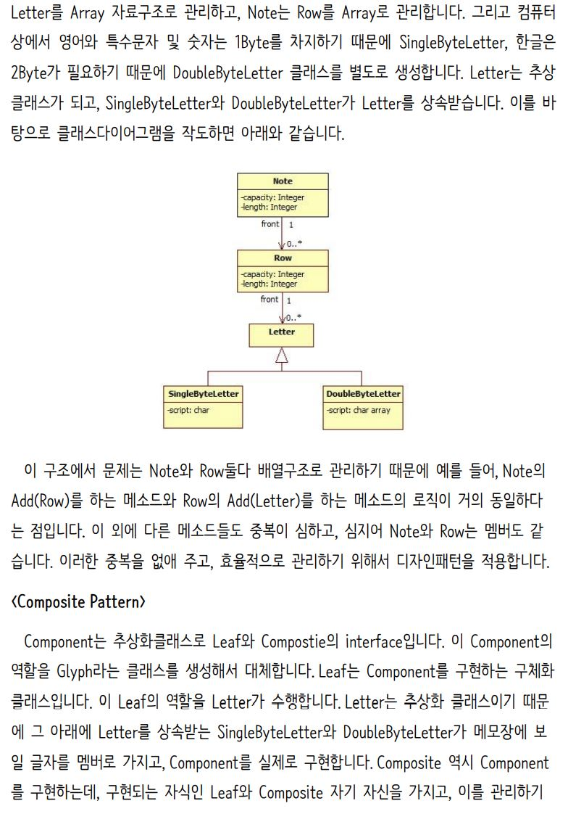
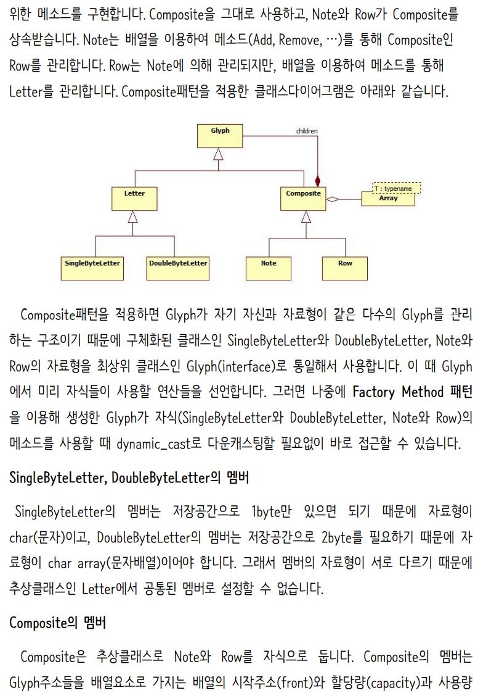
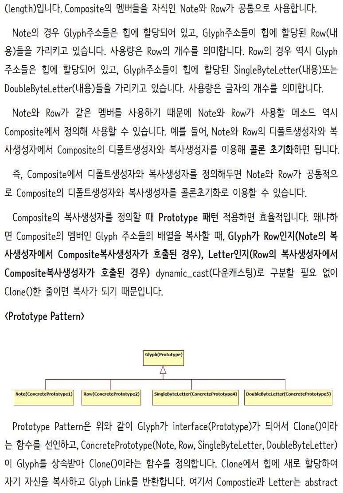
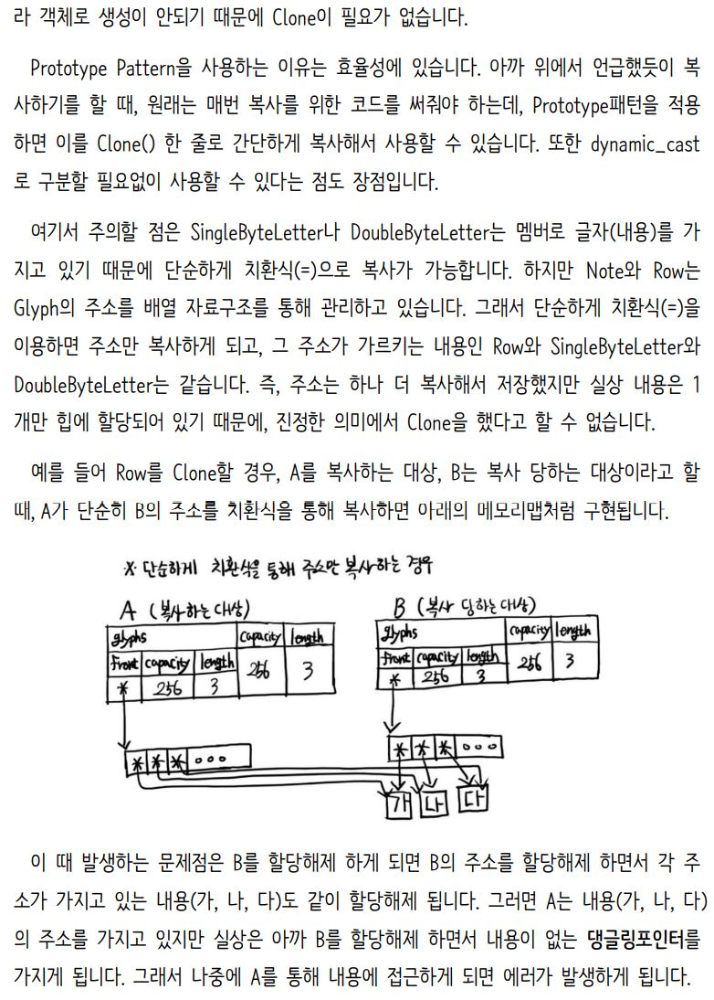
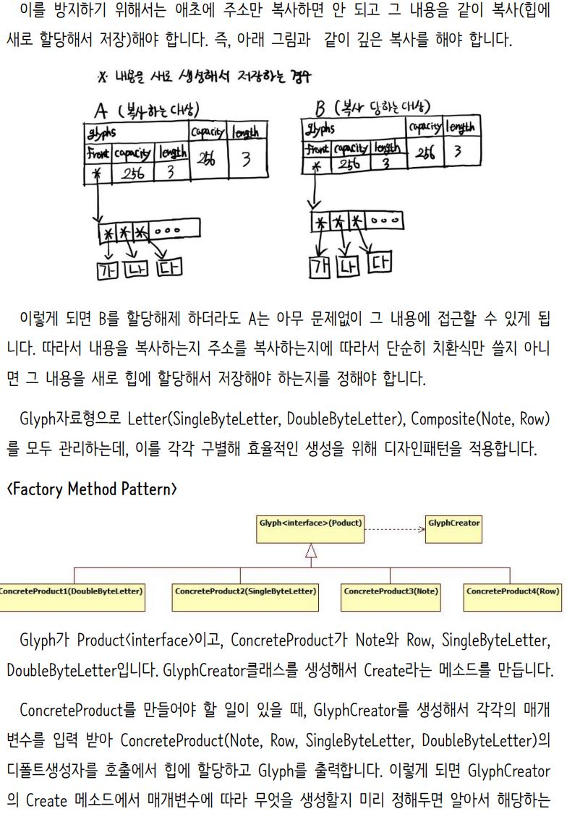
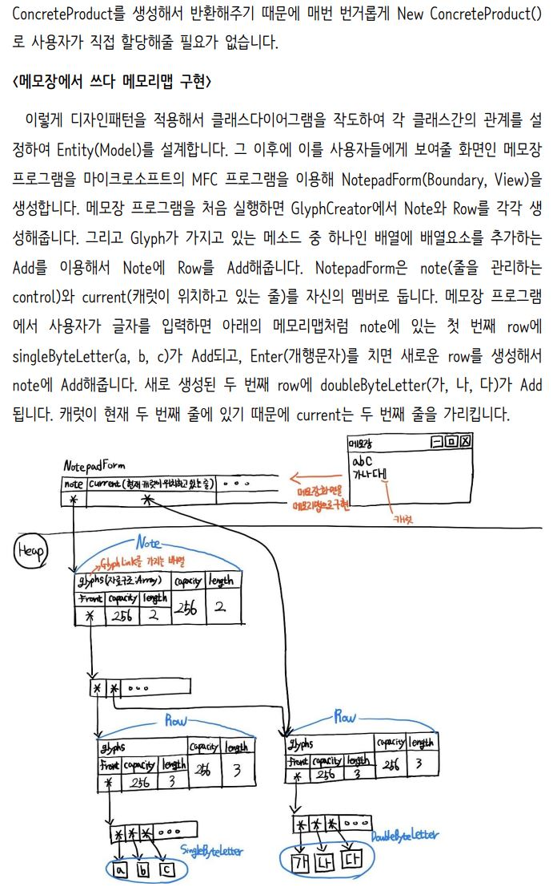
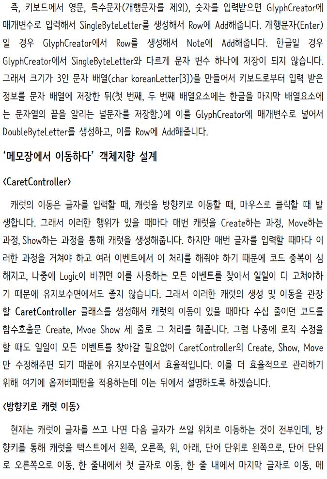
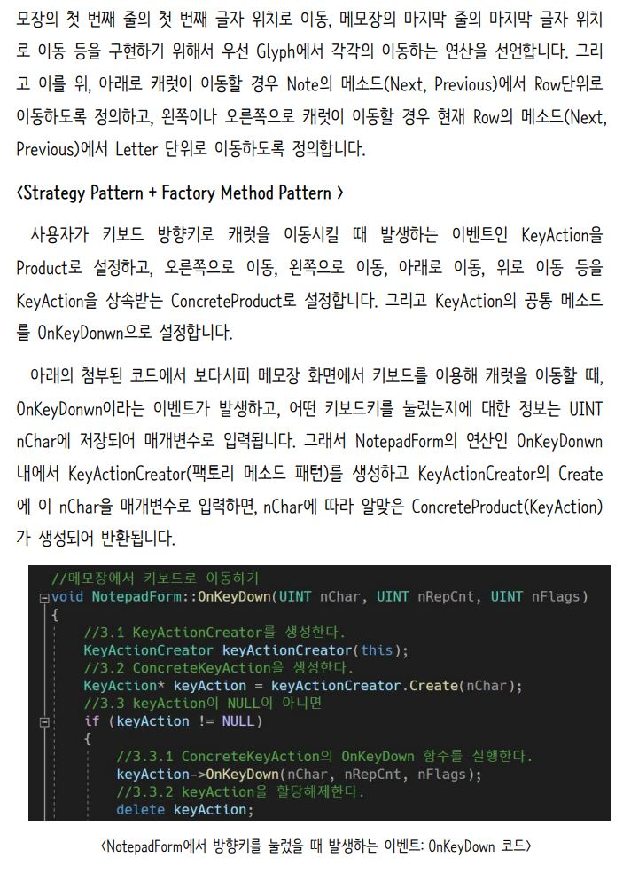

# 윈도우 기본 메모장을 C++로 내부 로직을 짜고, MFC로 GUI를 구현하였습니다.
## 디자인패턴(Composite, Factory Method, Prototype, Strategy, Command, Observer, Visitor)을 적용하여 윈도우 기본 메모장을 구현하였습니다.
### 여기에 기존 윈도우 메모장에서는 지원하지 않는 인쇄 미리보기 기능 추가하였습니다.
### 또한 기존 윈도우 메모장에서는 실행취소 및 다시실행이 1회만 되어 불편하였는데,
### 이를 개선하여 VisualStudio2019처럼 프로그램 종료 전까지 했던 모든 작업을 실행취소 및 다시실행할 수 있도록 기능을 개선시켰습니다.

